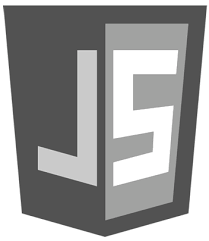

## Milestone 2 ------ Retaurant Cowhey Chez

### User Experience (UX)

#### User stories

**First Time Visitor Goals**

As a First Time Visitor, I want to easily access what the restaurant has to offer.

As a First Time Visitor, I want to be able to easily navigate throughout the site to see their menu and book a table.

As a First Time Visitor, I want to be able to undertand at a glimpse how the site works.

**Returning Visitor Goals**

As a Returning Visitor, I want to easily navigate the site and find exactly what I'm lookiing for.

As a Returning Visitor, I want to find the be able to easliy confirm a booking.

As a Returning Visitor, I want to see is there anymore information I may find out about the restaurant.

As a Returning Visitor, I want to be able to locate the restaurant should i decide to visit.

**Frequent User Goals**

As a Frequent User, I want to check to see if there are any newly added dishes to their menu.

As a Frequent User, I want to check to see if there are any new offers for regular customers.

As a Frequent User, I want to check for any  updates and/or changes to the prices.

This webpage is designed to be effective and efficient in providing the user with a simple and easy way to find something to eat.
The site will provide a very quick and easy interface to contact and communicate with the restaurant.
All the information they need from menu choices, prices, contact and booking a table as well as links to social media will all appear on the first page and grab their attention immediately.

**The Client**

Cowhey Chez is a very well renowned restaurant offering an extensive range of foods with a wide variety of choices. The restaurant are know to cater for all walks of life of all ages.
The prices are reasonable, the service is exceptional and the food is sensational. This is what needs to conveyed on the website.
___
## Design

**Colour Scheme**

The colours used are very simple indeed. I did not want to take from the images of food or the simple conveying of the message about the restaurant. There is a slight red theme in some of the images.

**Typography**

The Poppins, Aquafina and Lato fonts are used here as they are extremely easy to read and pleasant to look at. Ballet was used for the logo to style the name of the restaurant.

**Imagery**

Imagery is important. The large, main image is to show the user how freshly prepared the food is. The carousel below the descriptioin of the restaurant continues to scroll between images of the food.

**Wireframes**

Please click the following link to view the wireframes for the project:--------->[Milestone Wireframes](/workspace/Milestone-2/assets/wireframes/restaurantwireframe.pdf)

**Features**

Responsive on all device sizes

Interactive elements such as the Booking Form and social media links

## _Technologies & Languages Used_

     

### **Frameworks, Libraries & Programs Used**

[_**Bootstrap 5.0:**_](https://getbootstrap.com/docs/5.0/getting-started/introduction/ "Bootstrap")

Bootstrap was used to assist with certain aspects for the responsiveness and styling of the website.

[_**Tech Midpoint:**_](https://techmidpoint.com// "Tech Midpoint")

Tech Midpoint waas used to help create the image layout design and image placement.

[_**W3chools:**_](https://www.w3schools.com/cssref/sel_hover.asp "W3Schools")

Hover.css was used on the Social Media icons in the footer to add the float transition while being hovered over.

[**_Google Fonts:_**](https://fonts.google.com/ "Google Fonts")

Google fonts were used to import the **"Poppins, Lato and Parisienne"** fonts into the index.css file which is used on all pages throughout the project.

[**_Font Awesome:_**](https://fontawesome.com/ "Font Awesome")

Font Awesome was used on the footer social media links to add icons for aesthetic and UX purposes.

[_**Gitpod:**_](https://gitpod.io/workspaces/ "GitPod")

Git was used for version control by utilizing the Gitpod terminal to commit to Git and Push to GitHub.

[_**GitHub:**_](https://github.com/join/get-started "GitHub")

GitHub is used to store the projects code after being pushed from Git.

[_**Balsamiq Wireframes:**_](https://balsamiq.com/wireframes/?gclid=Cj0KCQjwi7yCBhDJARIsAMWFScNFj3Sxf-xCtB0PDStMlXWuD2krp9YS6AoJWD0fBYEqdoBmvKeXfc0aAlYpEALw_wcB "Balsamiq")

Balsamiq was used to create the wireframes during the initial design process and finally for the pdf link in the description.

## _Testing_

The W3C Markup Validator and W3C CSS Validator Services were used to validate every page of the project to ensure there were no syntax errors in the project.

[_**W3C Markup Validator**_](https://validator.w3.org/nu/#l169c53 "Dylan's Results") - Results:

[_**W3C CSS Validator**_](https://validator.w3.org/nu/#l1c81 "Dylan's Results") - Results:

___

## _Testing User Stories from User Experience (UX) Section_

**First Time Visitor Goals**

As a First Time Visitor, I want to understand the main purpose of the site and learn what I can on the restaurant.

Upon entering the site, users are automatically greeted with a clean and easily readable navigation bar to go to the page of their choice. The Navigation bar has three simple links offering one word choices. The images on the page scroll automatically to show the user a simple look at the different food options.

The user has two options, click the ABOUT, MENU or GALLERY action buttons or scroll down, both of which will lead to the same place. As soon as the user scrolls or clicks to a link an arrow will appear in the bottom right corner allowing them to click it to return to the top of the page.

As a First Time Visitor, I want to be able to easily navigate throughout the site to find content.

The site has been designed to be user friendly. At the top of the page there is a clean navigation bar, each link describes what page they will end up at.
The Navbar vanishes upon scrolling or clicking to the desired content but an arrow appears immediatley to allow a link to return to the top of the page for menu selection..
All content has been kept on one page to provide easy scrolling and access to each content. Since it was only three different pages of information it was a lot easier to keep them together and provide links to each part of the restaurant's content.

At the bottom of the page there are clear links and icons to the restaurant's social media content.
On the Make a Booking section, after a form response is filled it will send information to the restaurant. If all content is not filled out correctly a warning will appear to fill in what you have forgotten to do so.

As a First Time Visitor, I want to look for a menu and images of what is on offer. I want to see what kind of variety is available to me before i consider booking. I also want to locate their social media links to see if there are any reviews on social media to determine how the restaurant is rated and what people may have thought of their experience there.

Once the new visitor has read the About Us and Menu section, they will notice the Gallery section.
The user can also scroll to the bottom of the page on the site to locate social media links in the footer.

As a Returning Visitor, I want to find any new food content they may have added to their menu.

As a Returning Visitor, I want to find any updated reviews or ratings recently added to their social media pages..

The navigation bar clearly highlights the "About" Page.
After a brief description they can fill out the form on the page to make a booking.
The footer contains links to the restaurant's [Facebook](https://www.facebook.com "Cowhey Chez on Facebook"), [Twitter](https://twitter.com "Cowhey Chez on Twitter") and  [Instagram](https://www.instagram.com/ "Cowhey Chez Instagram Posts") pages.
Whichever link they click, it will be open up in a new tab to ensure the user can easily get back to the website.
The Send button is set up to automatically open up your email app and autofill there email address in the "To" section.

As a Returning Visitor, I want to find the social media links to be able to be kept informed of any new information the restaurant can offer.

### **Frequent User Goals**

As a Frequent User, I want to check to see if there are any newly added dishes or offers.

The user would already be comfortable with the website layout and can easily click social links.

As a Frequent User, I want to check to see if there is any new content information such as special offers or special openeing hours for holidays..

The user would already be comfortable with the website layout and can easily click to the section they are looking for.

As a Frequent User, I want to check in at anytime as to the closing time of the restaurant on certain holidays or bank holiday weekends or to see have prices or menu's changed.

At the bottom of the page their is a footer of which the content is easily acceessable.

### **Further Testing**

The Website was tested on Google Chrome in the development tools.
The website was viewed on a variety of devices such as Desktop and mobile view.
A large amount of testing was done to ensure that all pages were linking correctly.

### **Known Bugs**

The code was tested repeatedley  through [_**W3C Markup Validator**_](https://validator.w3.org/nu/#l169c53).
___

## _Deployment_

**GitHub Pages**

The project was deployed to GitHub Pages using the following steps...

* I added the new changes I made in the design and development
* I committed all changes and commented on what exactly i did in that session
* I finally pushed all ammendments to Github

## _Credits_

**Code**

The full-screen image and all images were created by the developer. 

[Bootstrap5:](https://getbootstrap.com/docs/5.0/getting-started/introduction/ "Bootstrap") Bootstrap Library used in certain aspects of the project mainly to create the Contact Form.

**Content**

The food used in the images was produced by the restautrant owner John Cowhey and full permission was given to use these images for this design and purpose.
All content was written by the developer.

[_**Tech Midpoint:**_](https://techmidpoint.com// "Tech Midpoint") coding was used in the development of the image layout design and image placement.

**Media**

All Images were created by the developer. All foods were produced by John Cowhey.

All logo's were created by the developer.

**Acknowledgements**

My friend [_**Tim Curtin:**_](http://timcurtin.ie/ "Tim Curtin") for his amazing knowledge and sound advice throughout this project.....Legend Tim....

Ulysses Ryan Flynn for his invaluable assistance in allowing me to extend my project deadline and help inform me of choices available to me. Many thanks Uly.....

Tutor support at [**_Code Institute:_**](https://codeinstitute.net/ "Code Institute") for their support.

_Cormac_ci_ code institude tutor and Classroom Co-ordinator for his help and extremely vital support.

_Neil Kavanagh_ci_ institute tutor and Classroom Co-ordinator again for his incredible input along the journey of my project.

[Slack](https://slack.com/intl/en-ie/ "Slack Community") community for help and advise along the way